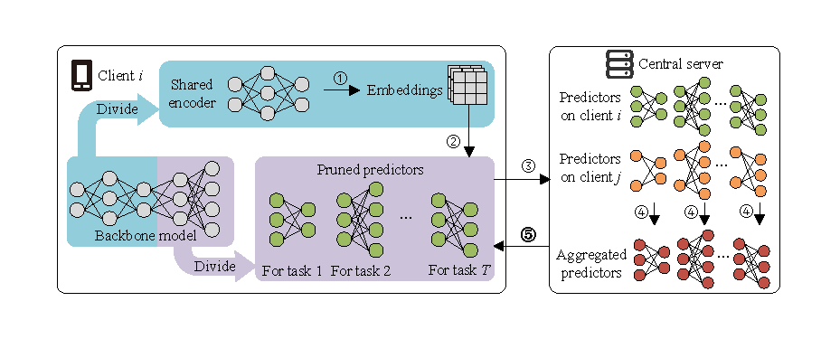

# FedLPS: Heterogeneous Federated Learning for Multiple Tasks with Local Parameter Sharing


<p align="center">
  <a href="https://github.com/FedML-AI/FedML/projects/1"></a>
  <a href="#"></a>
  <a href="#"></a>
</p>


This repository is the official PyTorch implementation of:
"FedLPS: Heterogeneous Federated Learning for Multiple Tasks with Local Parameter Sharing" (AAAI 2024).

[//]: # ()


## Abstract
Federated Learning (FL) has emerged as a promising solution in Edge Computing (EC) environments to process the proliferation of data generated by edge devices. By collaboratively optimizing the global machine learning models on distributed edge devices, FL circumvents the need for transmitting raw data and enhances user privacy. 
Despite practical successes, FL still confronts significant challenges including constrained edge device resources, multiple tasks deployment, and data heterogeneity.
However, existing studies focus on mitigating the FL training costs of each single task whereas neglecting the resource consumption across multiple tasks in heterogeneous FL scenarios. In this paper, we propose Heterogeneous Federated Learning with Local Parameter Sharing (FedLPS) to fill this gap. FedLPS leverages principles from transfer learning to facilitate the deployment of multiple tasks on a single device by dividing the local model into a shareable encoder and task-specific encoders. To further reduce resource consumption, a channel-wise model pruning algorithm that shrinks the footprint of local models while accounting for both data and system heterogeneity is employed in FedLPS. Additionally, a novel heterogeneous model aggregation algorithm is proposed to aggregate the heterogeneous predictors in FedLPS.
We implemented the proposed FedLPS on a real FL platform and compared it with state-of-the-art (SOTA) FL frameworks. The experimental results on five popular datasets and two modern DNN models illustrate that the proposed FedLPS significantly outperforms the SOTA FL frameworks by up to 4.88% and reduces the computational resource consumption by 21.3%.

## Requirements

Our code structure is based on <a href="https://github.com/FedML-AI/FedML">FedML</a> of version 0.8.3 but refactored 
for simplicity. This codebase is written for python3 (used python 3.7.11 while implementing).
We use Pytorch version of 1.9.1 and CUDA version of 11.2.
To install necessary python packages:
```
pip install -r requirements.txt
```
We use <a href="https://wandb.ai/">wandb</a> to keep a log of our experiments.
If you don't have a wandb account, just install it and use it as offline mode.
```
pip install wandb
wandb off
```

## How to Run Codes?

A simple demo for running FedLPS on non-IID setting of CIFAR10 dataset with ResNet model:

```
python ./fedml_experiments/standalone/fedlps/main_fedlps.py \
       --prefix fedlps_demo
       --model pre_resnet18
       --frozen_layer 1
       --dataset cifar10
       --partition_method hetero
       --partition_alpha 0.5
       --pr_strategy AD
       --epochs 1
       --client_num_in_total 2
       --client_num_per_round 2
       --comm_round 2
       --batch_size 64
       --lr 0.001
       --wd 0.001
       --gpu 0
       --dataparallel 0       
       --seed 0       
```

You can modify the arguments to run FedLPS on other settings. The arguments are described as follows:

| Arguments              | Description                                                                                                                                                       |
|------------------------|-------------------------------------------------------------------------------------------------------------------------------------------------------------------|
| `prefix`               | A prefix for logging and checkpoint saving.                                                                                                                       |
| `model`                | Neural network used in training. Options: `resnet18`, `shufflenet`, `pre_resnet18`, `pre_shufflenet`.                                                             |
| `frozen_layer`         | Layer number 'n' of the encoder. Options: `1` (n=0.25N), `2`(n=0.5N), `3`(n=0.75N).                                                                               |
| `dataset`              | Dataset used for training. Options: `mnist`, `fashionmnist`, `svhn`, `cifar10`, `cifar100`.                                                                       |
| `partition_method`     | How to partition the dataset on local clients.  Options: `homo` (IID setting), `hetero` (non-IID setting).                                                        |
| `partition_alpha`      | Partition alpha used in partition non-IID data.                                                                                                                   |
| `pr_strategy`          | Pruning ratio used to prune local models. Options: `0` (without pruning), `0.1`, `0.2`, `0.3`, `0.4`, `0.5`, `0.6`, `0.7`, `0.8`, `0.9`, `AD` (adaptive pruning). |
| `epochs`               | How many epochs will be trained locally.                                                                                                                          |
| `client_num_in_total`  | Number of clients in a distributed cluster.                                                                                                                       |
| `client_num_per_round` | Number of clients.                                                                                                                                                |
| `comm_round`           | How many round of communications we should use.                                                                                                                   |
| `batch_size`           | Input batch size for training.                                                                                                                                    |
| `lr`                   | Learning rate.                                                                                                                                                    |
| `wd`                   | Weight decay.                                                                                                                                                     |
| `gpu`                  | Specify the GPU number to run the program.                                                                                                                        |
| `dataparallel`         | Whether to enable multi-gpu acceleration.                                                                                                                         |
| `seed`                 | Random seed.                                                                                                                                                      |


